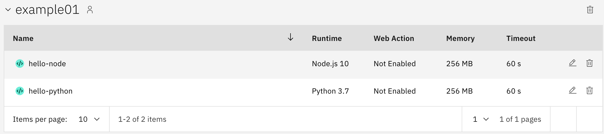

Example 01 - Hello World using NodeJs and Python
===========================

#### Create a Package for Example 01

```bash
$ ibmcloud fn package create example01

ok: created package example01
```

####  Create action using NodeJs example

```bash
ibmcloud fn action create example01/hello-node hello.js --kind nodejs:10
```


#### Create action using Python example

```bash
ibmcloud fn action create example01/hello-python hello.py --kind python:3.7
```


Looking at IBM Cloud console, you can see the new created Cloud Function


