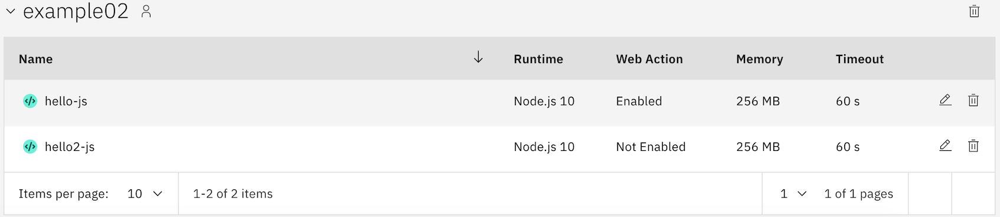
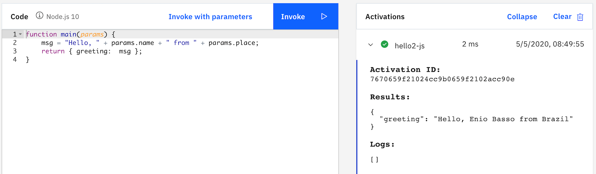

Example 02 - Using a manifest file to deploy
===========================

In below examples, we will deploy IBM Cloud Functions using a manifest.yaml file.

# Deploying hello.js 

Sample manifest.yaml file

```yaml
 packages:
   example02:
     version: 1.0
     license: Apache-2.0
     actions:
       hello-js:
         function: hello.js
         web-export: true
     apis:
       hello-js-api:
         hello:
           world:
             hello-js:
               method: GET
               response: http
```
The deployment manifest file defines the following variables.

* The package name.
* The action name.
* The action code file name.
* The action annotation that indicates it is to be a web action. **web-export: true**
* The API with a base path of **/hello**.
* The endpoint path of **/world**.


Create action using NodeJs example

```sh
$ cd example02

$ ibmcloud fn deploy --manifest hello_js_manifest.yaml

Success: Deployment completed successfully.
```

List the actions by using the following command.

```sh
$ ibmcloud fn action list

actions
/<GUID>/example02/hello-js               private nodejs:10
/<GUID>/example01/hello-python           private python:3.7
/<GUID>/example01/hello-node             private nodejs:10
```

List the APIs by using the following command.

```bash
$ ibmcloud fn api list -f

ok: APIs

Action: /<GUID>/example02/hello-js
   API Name: hello-world
   Base path: /hello
   Path: /world
   Verb: get
   URL: https://service.us.apiconnect.ibmcloud.com/gws/apigateway/api/NNNN...NNNNN/hello/world
```

Invoke the api using curl or copy and paste url on your browser

```sh
curl <URL-FROM-API-LIST-OUTPUT>

Hello world
```


# Deploying hello2.js 

Sample manifest.yaml file

```yaml
packages:
  example02:
    version: 1.0
    license: Apache-2.0
    actions:
      hello2-js:
        function: hello2.js
        inputs:
          name: Enio Basso
          place: Brazil
      #SecondAction:
        #docker: your-username/docker-hub-repo
```
The deployment manifest file defines the following variables.

* The package name.
* The action name.
* The action code file name.
* The action inputs. **web-export: true**

Create action using NodeJs example

```sh
$ ibmcloud fn deploy --manifest hello2_js_manifest.yaml

Success: Deployment completed successfully.
```

Looking at IBM Cloud console, you can see the new created Cloud Function



Click on the pencil icon. After open, click on **Invoke** button, to see result:




If you want to run passing the parameters, click on **Invoke with parameters**, and add

```json
{
   "name": "<put your name here>",
   "place": "<put your place here>"
}
```

click **Apply** and **Invoke**
