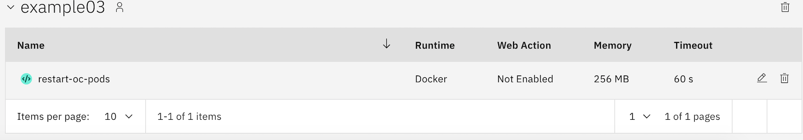

Example 03 - Using IBM Cloud Functions to Restart Pods on Openshift
===========================


#### Preparing environment:

```bash
cd ibm-cloud-functions-examples/example03/install_dir
wget https://mirror.openshift.com/pub/openshift-v4/clients/oc/latest/linux/oc.tar.gz

cd ..
chmod a+x ibmfnc.sh
```

Defining necessary environment variables

```bash
export DOCKER_MAINTAINER="<YOUR_EMAIL_ADDRESS>"
export DOCKERHUB_USERNAME="<YOUR_USER_ON_DOCKER_HUB>"
```

Build your custom Docker image

```bash
./ibmfnc.sh build
```

Checking my image

```bash
$ docker images

REPOSITORY                                      TAG                 IMAGE ID            CREATED             SIZE
<YOUR_USER_ON_DOCKER_HUB>/restart-oc-pods       latest              c07065f08e57        6 seconds ago       301MB
```

#### Running Container

Defining necessary environment variables to test:

```bash
export IBMCLOUD_OC_TOKEN=""
export IBMCLOUD_OC_CONSOLE="https://cNNN-e.us-south.containers.cloud.ibm.com:NNNNN"
export IBMCLOUD_OC_PROJECT=""
export SLEEP_TIME="5"
```

where:

* IBMCLOUD_OC_TOKEN:  token to authenticate against OpenShift on IBM Cloud.
* IBMCLOUD_OC_CONSOLE:  url to OpenShift on IBM Cloud.
* IBMCLOUD_OC_PROJECT:  need to define project on OpenShift.

Running the script

```bash
./ibmfnc.sh run
```

#### Running container manually

```bash
docker run -e IBMCLOUD_OC_TOKEN -e IBMCLOUD_OC_CONSOLE -e IBMCLOUD_OC_PROJECT $DOCKERHUB_USERNAME/restart-oc-pods
```


# Upload Container to Docker Hub

1. Login on Docker Hub

```bash
docker login 
```

2. Push image

```bash
docker push $DOCKERHUB_USERNAME/restart-oc-pods
```

# Deploying an action with a custom Docker image

using manifest.yaml file
```bash
$ ibmcloud fn deploy --manifest manifest.yaml

ok: created action example03/restart-oc-pods
```
or manually

```bash
$ ibmcloud fn package create example03

$ ibmcloud fn action create example03/restart-oc-pods --docker $DOCKERHUB_USERNAME/restart-oc-pods

ok: created action example03/restart-oc-pods
```

Run and get logs

```bash
$ ibmcloud fn action invoke example03/restart-oc-pods --result

ok: invoked /_/example03/restart-oc-pods, but the request has not yet finished, with id <ACTIVATION_ID>

$ ibmcloud fn activation get <ACTIVATION_ID>
```


Looking at IBM Cloud console, you can see the new created Cloud Function

